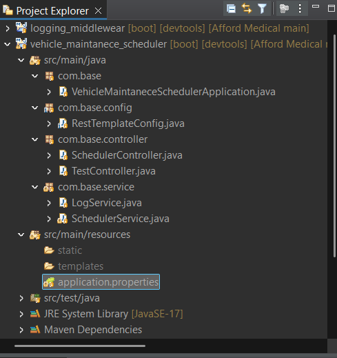
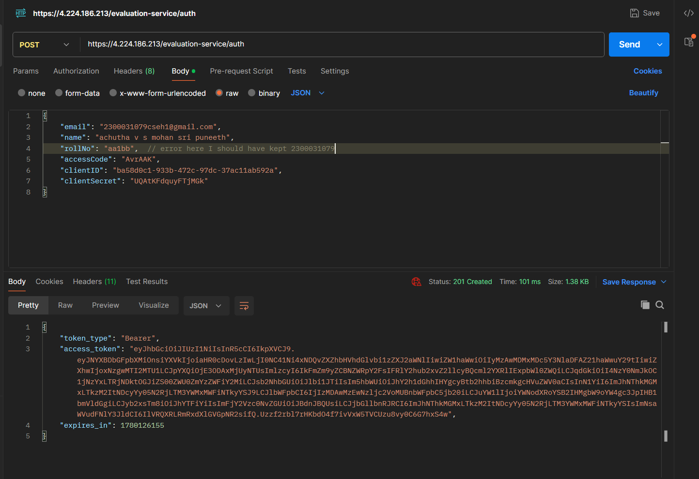
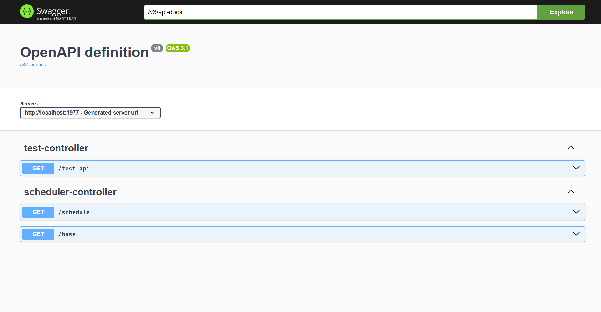

Notification System Design

Project Architecture

Registration Response

Swagger Documentation

Stage 1

To support a campus notification platform, I would create APIs for viewing notifications, creating notifications, marking notifications as read, and deleting notifications. These APIs would allow students to access their notifications and administrators to send updates.

The main APIs would be:

GET /notifications

GET /notifications/{id}

POST /notifications

PUT /notifications/{id}/read

PUT /notifications/read-all

DELETE /notifications/{id}

A notification can contain information such as notification ID, student ID, notification type, message, read status, and creation time.

Example:

{
"id": "uuid",
"studentId": "2300031079",
"type": "Placement",
"message": "TCS shortlisted candidates announced",
"isRead": false,
"createdAt": "2026-05-30T12:00:00"
}

For real-time updates, I would use WebSockets so that students can receive notifications instantly without refreshing the page.

---

Stage 2

For storing notification data, I would choose PostgreSQL because it is reliable, scalable, and provides strong support for indexing and query optimization.

Sample schema:

CREATE TABLE notifications (
id UUID PRIMARY KEY,
student_id VARCHAR(20),
notification_type VARCHAR(20),
message TEXT,
is_read BOOLEAN DEFAULT FALSE,
created_at TIMESTAMP DEFAULT CURRENT_TIMESTAMP
);

As the system grows, there may be millions of notifications. This can lead to slower queries, increased storage requirements, and performance issues.

To handle this, I would use indexing, partitioning based on dates, and archive old notifications that are no longer frequently accessed.

---

Stage 3

The existing query fetches unread notifications for a student.

SELECT *
FROM notifications
WHERE student_id = 1042
AND is_read = false
ORDER BY created_at DESC;

To improve performance, I would create a composite index.

CREATE INDEX idx_student_read_created
ON notifications(student_id, is_read, created_at DESC);

I would not create indexes on every column because too many indexes increase storage usage and slow down insert and update operations.

To fetch placement notifications from the last seven days, I would use:

SELECT *
FROM notifications
WHERE notification_type = 'Placement'
AND created_at >= NOW() - INTERVAL '7 days';

---

Stage 4

Currently, notifications are fetched directly from the database every time a student opens the application. As the number of users grows, this can increase database load and reduce performance.

To solve this problem, I would introduce Redis as a caching layer.

Architecture:

Client → Application → Redis Cache → PostgreSQL

With Redis, frequently accessed notifications can be served quickly without repeatedly querying the database.

The main advantages are improved response times, reduced database load, and better scalability.

One challenge is cache invalidation. Whenever notifications are updated, the cache must also be updated to maintain consistency.

---

Stage 5

The current implementation processes notifications one by one.

for student_id in student_ids:
send_email(student_id, message)
save_to_db(student_id, message)
push_to_app(student_id, message)

This approach becomes inefficient when notifications need to be sent to thousands of students.

Some issues include slow execution, lack of retry mechanisms, and difficulty handling failures.

To improve scalability, I would introduce a message queue such as Kafka or RabbitMQ.

Architecture:

Notification Service → Message Queue → Worker Services

The worker services would then handle email delivery, database updates, and push notifications independently.

This approach supports retries, dead-letter queues, and asynchronous processing, making the system more reliable and scalable.

I would avoid combining email sending and database updates in the same transaction because email delivery is handled by an external service and cannot participate in database transactions.

---

Stage 6

To improve the user experience, I would implement a priority inbox that displays the most important unread notifications first.

Examples include placement notifications, examination results, and important events.

A priority score can be calculated using both notification type and recency.

Priority Score = (Type Weight × 0.7) + (Recency Weight × 0.3)

Example weights:

Placement = 100

Result = 80

Event = 50

Swagger Documentation :

To make testing and API exploration easier, Swagger/OpenAPI has been integrated into the project.

Dependency Used:

<dependency>
    <groupId>org.springdoc</groupId>
    <artifactId>springdoc-openapi-starter-webmvc-ui</artifactId>
    <version>2.8.5</version>
</dependency>

After running the Spring Boot application, the API documentation can be accessed using:

Swagger UI:

http://localhost:1977/swagger-ui/index.html

OpenAPI Specification:

http://localhost:1977/v3/api-docs

Swagger was included to simplify API testing, endpoint verification, and request/response visualization during development.

To efficiently retrieve high-priority notifications, I would use a Priority Queue (Max Heap).

This allows the system to quickly identify the most important notifications while maintaining good performance even when the number of notifications grows significantly.

Overall, this design provides scalability, efficient querying, fast notification delivery, and a better experience for students using the platform.

The scheduler logic, API structure, logging middleware, and optimization algorithm are implemented.
The external API call may return 401 because the token was generated with incorrect registration details.